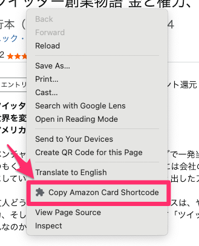

# `amazon` shortcode for Hugo

## shortcodes

### setup

set files as following tree

```tree
assets/
└── css
    └── amazon.css

layouts/
├── partials
│   └── extend_head.html (*)
└── shortcodes
    └── amazon.html

```

(*) add css link to `extend_head.html`

```html
{{- if .HasShortcode "amazon" -}}
{{- $amazon_css := resources.Get "css/amazon.css" | resources.Minify }}
<link rel="stylesheet" href="{{ $amazon_css.RelPermalink }}">
{{- end -}}
```

### usage

```md

```

show as


## Chrome extension

1. access to `chrome://extensions`
1. enable "Developer mode"
1. add extension files via "Load unpacked"

copy shortcode via context menu


